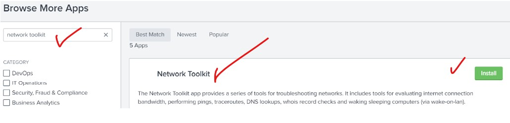
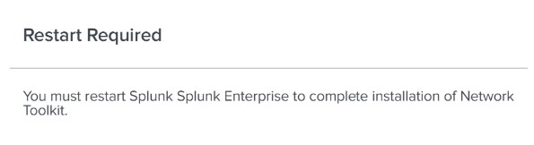
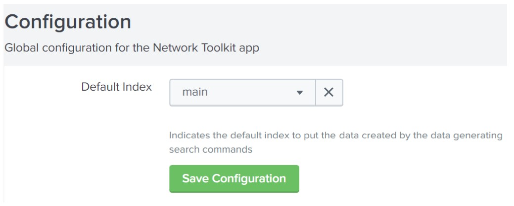
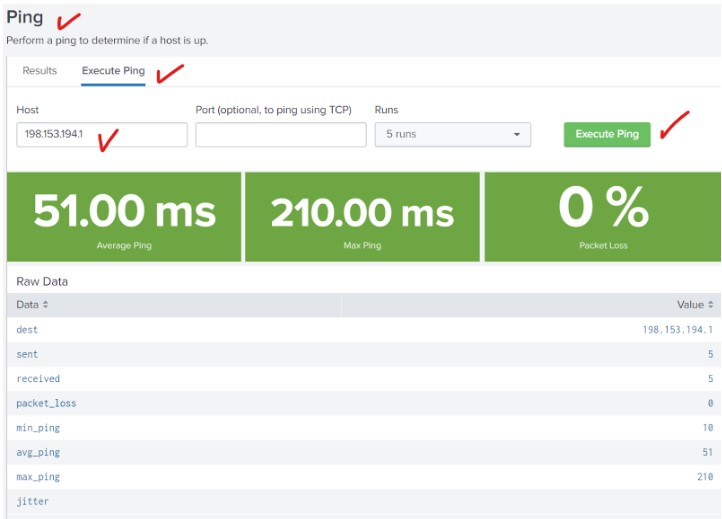
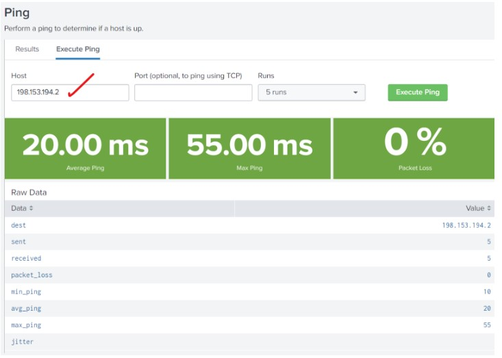
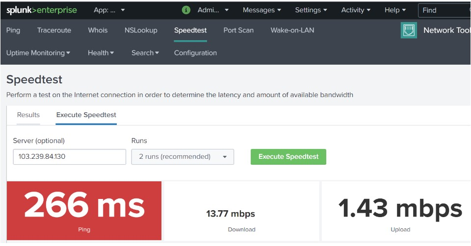
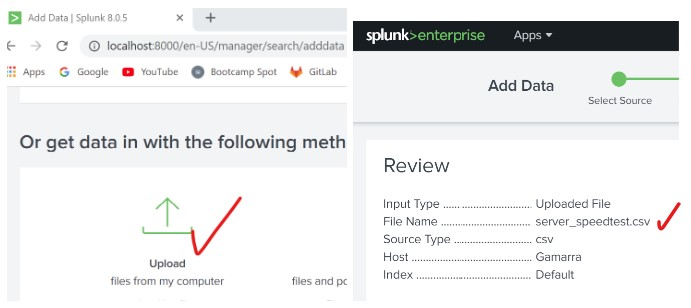
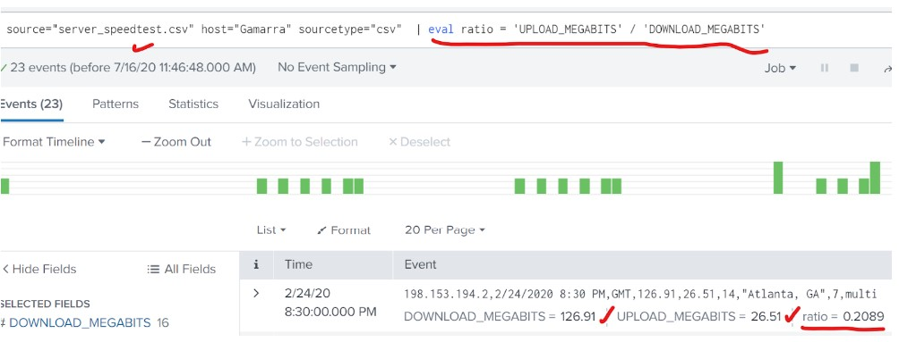
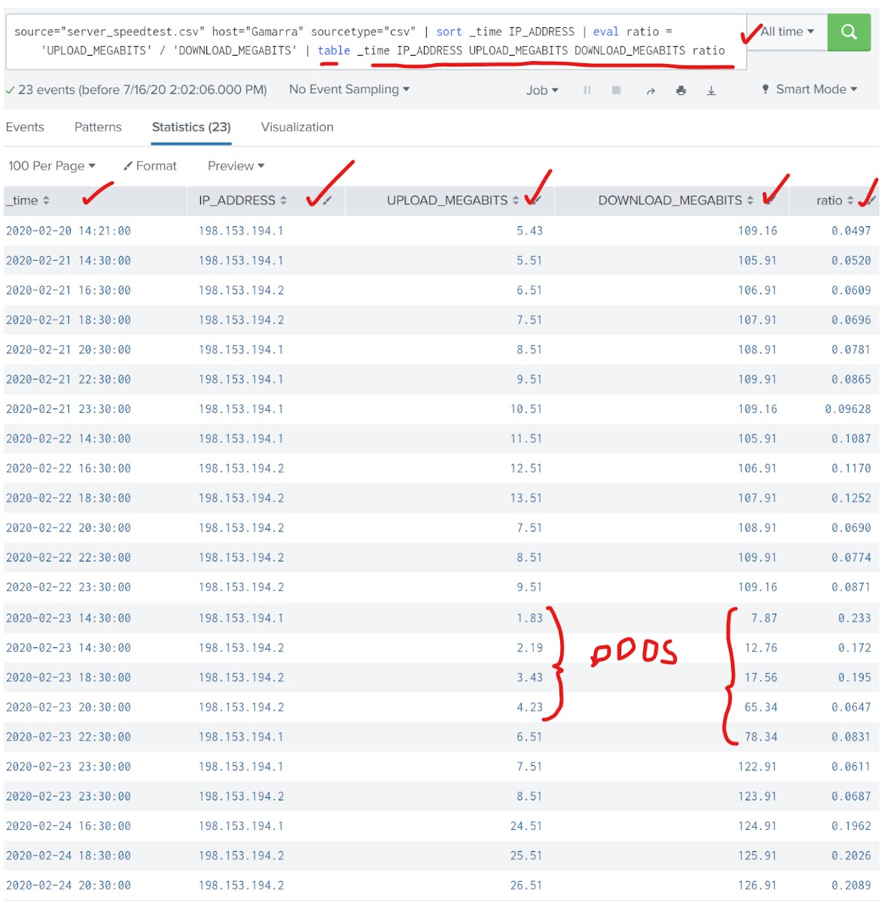

# SIEM - Design A Splunk Monitoring Solution 

## Introduction

<ins>OBJECTIVE</ins>: Demonstrate my ability to design a powerful Splunk Enterprise Security monitoring solution to protect a customer from security attacks.

<ins>My Skills and Knowledge Applied</ins> 
- Researching and adding new apps
- Installing new apps
- Uploading files
- Splunk searching
- Using fields
- Custom reports
- Custom alerts

<ins>What is Splunk ES?</ins>

Splunk Enterprise Security (ES) is a Security Information and Event Management (SIEM) tool based on the Splunk data platform, a big data software solution that also provides many solutions outside cybersecurity. Splunk ES specializes in assisting with the key defensive concepts of continous monitoring, log collection, aggregation, parsing, normalization, searching and correlation. 

Splunk solutions can be enhanced by <ins>Splunk Apps</ins>, which users can add to their Splunk base product that have custom searches and features, with their own interface.  These differ from <ins>Splunk Addons</ins>, which are smaller components that provide additional functionality without their own interface.

## Attack Scenario
For the purposes of this project, I presume to be a new SOC Analyst for a company, Vandalay Industries. Vandalay uses Splunk ES as their SIEM.  

The following attacks and challenges are in play:
- Web server outage due to a DDOS attack
- Upload/Download speed have been significantly impacted
- Brute force attacks against administrator accounts
- Management suspects the database servers might be vulnerable and are in need of an assessment.

## Outline of Deliverables
- Install SIEM Monitoring Features
- Monitor Web Servers (ping, packet loss, speed)
- Report: Impact on Speed and Ratio of upload/download
- Report: Critical Vulnerabilities Scan
- Create Alert Notification
 
## Install SIEM Monitoring Features
- Install the Splunk App, **Network Toolkit**, on Splunk ES.
- Restart Splunk to finalize install
- Continue Analysis as **sysadmin**
- Configure search index storage locations

### Results
- Install **Network Toolkit**

- Restart and finalize install

- Login as Admin to continue analysis

- Configure where the index for searches will be stored.

## Monitoring Web Servers
- Confirm server availability through a ping
- Run a packet loss check
- Run a current speed test

### Results
- Confirm web servers are available for monitoring by executing ping of Vandalay's web servers, **198.153.194.1** and **198.153.194.2**. 

- Run a packet loss check on the web servers

- Run a current speed test on server 2

## Analyze Log Data From DDOS Attack
- Add Log Data to SIEM

Use Splunk Processing Language (SPL) to:
- Create a virtual field showing ratio of upload:download speed.
- Create a Splunk report showing statistics for: time, ip_address, downloaded megabits, uploaded megabits, upload/download ratio.
- Conclude: 1) approximate date/time of attack, 2) How long did it take systems to recover?

### Results
- **Upload Log Data**

**Use Splunk SPL to create a virtual field of ratio between upload/download speeds**

- **Create a Report using the TABLE SPL command to display: time, ip_address, downloaded megabits, uploaded megabits, upload/download ratio**

### Log Conclusions
- The DDoS attack started at:  14:30 on 23-Feb-2020
- The DDoS attack ended at: 23:30 on 23-Feb-2020
- The attack lasted approximately 9 hours by which time speeds had recovered.
- A symptom of a DDoS attack is decrease in internet speed due to over-usage of bandwidth to complete the attack.
