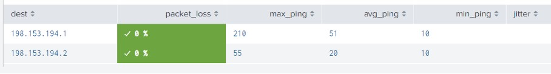

# SIEM - Design A Splunk Monitoring Solution 

## Project Outline
- Introduction
- Attack Scenario
- List of Project Deliverables
- Tasks and Results Documentation

## Introduction

<ins>OBJECTIVE</ins>: Demonstrate my ability to design a powerful Splunk Enterprise Security monitoring solution to protect a customer from security attacks.

<ins>My Skills and Knowledge Applied</ins> 
- Searching for Splunk apps
- Installing a Splunk app
- Uploading log files
- Splunk searching of log data
- Using Splunk Processing Language (SPL)
- Using fields
- Creating custom reports
- Creating custom alerts

<ins>What is Splunk ES?</ins>

Splunk Enterprise Security (ES) is a Security Information and Event Management (SIEM) tool based on the Splunk data platform, a big data software solution that also provides many solutions outside cybersecurity. Splunk ES specializes in assisting with the key defensive concepts of continuous monitoring, log collection, aggregation, parsing, normalization, searching and correlation. 

Splunk solutions can be enhanced by <ins>Splunk Apps</ins>, which users can add to their Splunk base product. Apps have custom searches and features with their own interface.  These differ from <ins>Splunk Add-ons</ins>, which are smaller components that provide additional functionality without their own interface.

Splunk Processing Language (SPL) is similar to SQL except that Splunk SPL is designed to search events rather than database table columns. (https://docs.splunk.com/Documentation/Splunk/latest/SearchReference/SQLtoSplunk)

## Attack Scenario
<ins>Assumption</ins>: I am new SOC Analyst for a company, Vandalay Industries, which has Splunk ES as their SIEM.

The following attacks and challenges are in play:
- Web server outage due to a DDOS attack
- Upload/Download speed have been significantly impacted
- Brute force attacks against administrator accounts
- Management suspects the database servers might be vulnerable and are in need of an assessment.

## List Of Project Deliverables
- Install SIEM Monitoring Features
- Monitor Web Servers (ping, packet loss, speed)
- Analyze/Conclude On "Speed Test" Log Data From DDOS Attack
- Create DDOS Attack Alert Notification
- Analyze/Conclude On Vulnerability of Data Server
- Create Vulnerability Alert Notification
- Analyze/Conclude On "Admin" Log Data From Brute Force Attack
- Create Brute Force Attack Alert Notification
 
## Install SIEM Monitoring Features
- Install the Splunk App, **Network Toolkit**, on Splunk ES.
- Continue analysis as **sysadmin**
- Configure search index storage locations

### Results
- //////// **Install "Network Toolkit" app** ////////

- //////// **Login as Admin to continue analysis** ////////

- //////// **Configure where the index for searches will be stored** ////////

## Monitor Web Servers
- Confirm server availability through a ping
- Run a packet loss check
- Run a current speed test

### Results
- //////// **Confirm web servers availability by pinging 198.153.194.1 and 198.153.194.2** //////// 

- //////// **Run a packet loss check on the web servers** ////////

- //////// **Run a current speed test on server 2** ////////

## Analyze/Conclude <ins>SPEED TEST</ins> Log From DDOS Attack
- Add Speed Test Log Data to SIEM
Use Splunk Processing Language (SPL) to:
- Create a virtual field showing ratio of upload:download speed.
- Create a Splunk report showing statistics for: time, ip_address, downloaded megabits, uploaded megabits, upload/download ratio.
- Conclude: 1) approximate date/time of attack, 2) How long did it take systems to recover?

### Results
- //////// **Upload Log Data** ////////

- //////// **Use Splunk SPL to create a virtual field of ratio between upload/download speeds** ////////

- //////// **Create a report using the TABLE SPL command to display: time, ip_address, downloaded megabits, uploaded megabits, upload/download ratio** ////////

//////// **Log Conclusions** ////////
- The DDoS attack started at:  14:30 on 23-Feb-2020
- The DDoS attack ended at: 23:30 on 23-Feb-2020
- The attack lasted approximately 9 hours by which time speeds had recovered.
- A symptom of a DDoS attack is decrease in internet speed due to over-usage of bandwidth to complete the attack.

## Determine Data Server Vulnerability
- Upload Nessus Scan Results
- Create a Splunk report to determine how many critical vulnerabilities exist on the customer data server

### Results

- //////// **Upload Nessus Vulnerability Scan results** ////////

- //////// **Create a report counting data server vulnerabilities** ////////

## Build an alert to monitor the data server
- Create an email alert that monitors every day to see if this server has any critical vulnerabilities. If a vulnerability exists, have an alert emailed to soc@vandalay.com

### Results

- //////// **Create and email alert for the data server** ////////

Complete the following fields in the resulting SAVE AS ALERT window and press SAVE.  Set:
Title: Critical Vulnerability Detected - 10.11.36.23 ; Description: Customer Database Server ; Alert Type: Run Every Day ; Trigger Alert When: IS GREATER THAN 0
SELECT Trigger Action/Add Actions: Send EMAIL
To: soc@vandalay.com, Priority: Highest, Include Link, Trigger Time, PDF

## Analyze Administrator Logs For a BRUTE FORCE Attack
- Analyze administrator logs that document a brute force attack. Then, create a baseline of the ordinary amount of administrator bad logins and determine a threshold to indicate if a brute force attack is occurring.

### Results
- //////// **Upload admin logs** ////////

- //////// **Identify Time of Brute Force** ////////

- //////// **Determine a baseline of normal activity** ////////

- The baseline of normal activity is between 0 and 23 events per hour based on the timeframe history of the logged events, which is approximately 35 hours.
- The minimum brute-force activity for this incident was 34 events per hour.  This leaves a gap of 23-33 events that could be either normal activity or malicious in future activity.  A hacker could potentially use “rates of events” in the gap window to mask themselves from detection.  Given that both future normal and malicious activity could have an unknown statistical deviation +/-, the alert threshold should be set to 28, the midpoint of the gap window.  If we could obtain more historical files to determine what is “normal”, the threshold could be revised.  

- //////// **Create and email alert to check threshold hourly** ////////

Creating SPL
Researching Splunk Documentation, there is an “earliest” command that filters based on the default _time field to retrieve a specific range of records based on parameter set
In this case, we want to search for records whose timestamp is within the last 60 minutes and status = “An account failed to login.
Based on the following print screens, enter search SPL as follows with earliest=-60m which commands to only search for records generated in the last hour.:
source="administrator_logs.csv" host="gamarra" sourcetype="csv" name="An account failed to log on" earliest=-60m | table name _time src_ip
 As a test, I ran the report with the earliest command set to detect records in the uploaded logs.  The test setting would be “earliest= - 213120”.  Results were returned thus confirming validity of command.

Set  earliest=-60m for production level alert.

 
Creating Hourly Alert
On the search window, click SAVE AS and select ALERT.  Complete as follows
Title:  Hourly Attack Check
Description: Check for DDOS attach by failed login attempts”
Alert Type:  Scheduled EVERY HOUR
Trigger alert when:  Number of results is Greater than 24
Add Action : select SEND EMAIL
To: soc@vandalay.com
Priority: highest
Click SAVE
Screenshots as follows:

